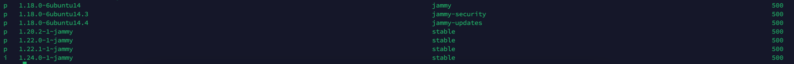

### 前言
由于Ubuntu源中Nginx的版本太低，无法实时跟上Nginx官方的版本，所以需要自定义Nginx源地址
<!-- more -->
### 实现
```shell
sudo apt install -y apt-transport-https
# 添加Nginx的官方仓库密钥：
curl -fsSL https://nginx.org/keys/nginx_signing.key | sudo gpg --dearmor -o /usr/share/keyrings/nginx-archive-keyring.gpg
# 添加Nginx的仓库信息到apt源列表中
echo "deb [signed-by=/usr/share/keyrings/nginx-archive-keyring.gpg] https://nginx.org/packages/ubuntu/ $(lsb_release -cs) nginx" | sudo tee /etc/apt/sources.list.d/nginx.list
# 更新源
sudo aptitude update
```
### 安装指定版本的Nginx
**查看所有的Nginx版本**
```shell
sudo aptitude versions nginx
```

**安装Nginx**
```shell
sudo aptitude install nginx=1.24.0-1~jammy -y
```

**到此Nginx就安装完成了**