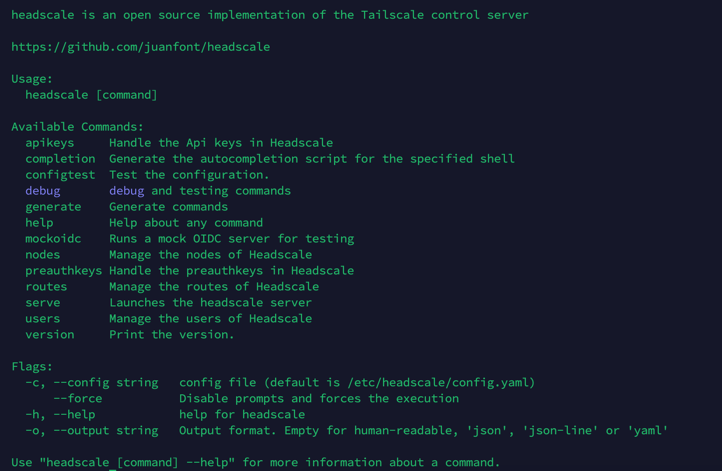
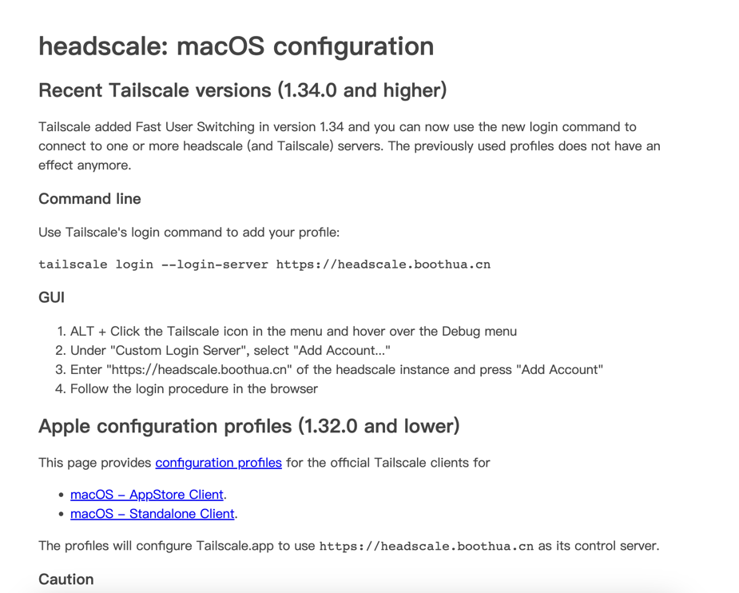

### 简介
> 
> 由于Tailscale的托管服务器是有数量限制的，并且服务器大多都在国外；如果国内用户想要使用，就必须得忍受网络延迟带来的影响。
> 那么Headsale就来了，Headscale是一个开源的、免费的、可以在任何地方部署的管理Tailscale的服务端；
> 
> 按照官方的话来说是："An open source, self-hosted implementation of the Tailscale control server."
> 
> Headscale 旨在实现 Tailscale 控制服务器的自托管、开源替代方案。Headscale 的目标是为自托管者和爱好者提供可用于其项目和实验室的开源服务器。它实现了一个狭窄的范围，一个单一的 Tailnet，适合个人使用，或小型开源组织。
> 
### 安装
> 准备：
> 1. 需要一台公网服务器，如果需要安装在内网服务器的话也可以，我觉得没必要；后面会提到在非公网机器安装需要注意的一些事项
> 2. 一个域名(国内域名需要备案)
> 3. 操作系统：Ubuntu22.04 Server amd64，这是我的配置，仅供参考
> 4. 从Headscale GitHub发布页面下载[安装包](https://github.com/juanfont/headscale/releases)
> 5. 下载官方[示例配置文件](https://github.com/juanfont/headscale/blob/main/config-example.yaml)
#### 安装到宿主机
创建目录 /etc/headscale
```shell
sudo mkdir /etc/headscale
```
将官方示例配置文件放到/etc/headscale路径下
```shell
sudo cp config-example.yaml /etc/headscale/config.yaml
```
修改配置文件,以下是需要修改的地方
```yaml
# 建议使用域名并且申请ssl证书,实在没有的话，往下看吧
server_url: https://xx.xx.xx:8080
# IP配置，这是分配给Tailscale客户端的IP段，可以自定义
ip_prefixes:
  - fd7a:115c:a1e0::/48
  - 100.64.0.0/10
# 中继服务配置
derp:
  server:
    # 默认关闭，可以开启，但是上面的server_url必须配置成https
    enabled: true
    # 保持不变
    region_id: 999
    region_code: "headscale"
    region_name: "Headscale Embedded DERP"
    # STUN连接监听端口，协助NAT遍历
    stun_listen_addr: "0.0.0.0:3478"

  # 默认的中继服务列表,如果不想使用国外的中继，可以不需要,如何配置参考下面的path
  urls:
    - https://controlplane.tailscale.com/derpmap/default
  # paths:
  #   - /etc/headscale/derp-example.yaml
  paths: []
```
开始安装
```shell
sudo dpkg -i headscale_0.22.3_linux_amd64.deb
# 稍等片刻... ...
# 设置开启启动
sudo systemctl enable headscale.service
# 启动headscale服务
sudo systemctl start headscale.service
# 测试,不出意外的话，会出现帮助提示
sudo headscale -h
```

#### Docker 安装
> 1. 准备docker-compose.yml文件
> 2. 准备config.yaml，和宿主机安装一样的，这一步是防止配置文件丢失

```yaml
version: '3'
services:
  headscale:
    image: headscale/headscale
    container_name: headscale
    hostname: headscale
    environment:
      - TZ=Asia/Shanghai
    ports:
      - "8080:8080"
    restart: always
    volumes:
      - ./headscale/:/etc/headscale/
    command: [ "headscale", "serve" ]
```
开始安装
```shell
docker-compose up -d headscale
docker logs -f headscale
```

### 反向代理
```conf
map $http_upgrade $connection_upgrade {
    default      keep-alive;
    'websocket'  upgrade;
    ''           close;
}
server {
    listen 443 ssl http2;
    listen [::]:443 ssl http2;
    #填写绑定证书的域名
    server_name xx.xx.xx;
    #证书文件名称
    ssl_certificate  xx.crt;
    #私钥文件名称
    ssl_certificate_key xx.key;
    ssl_session_timeout 5m;
    ssl_ciphers ECDHE-RSA-AES128-GCM-SHA256:ECDHE:ECDH:AES:HIGH:!NULL:!aNULL:!MD5:!ADH:!RC4;
    ssl_protocols TLSv1.2 TLSv1.3;
    ssl_prefer_server_ciphers on;
    location / {
        proxy_pass  http://127.0.0.1:8080;
        proxy_http_version 1.1;
        proxy_set_header Upgrade $http_upgrade;
        proxy_set_header Connection $connection_upgrade;
        proxy_set_header Host $server_name;
        proxy_redirect http:// https://;
        proxy_buffering off;
        proxy_set_header X-Real-IP $remote_addr;
        proxy_set_header X-Forwarded-For $proxy_add_x_forwarded_for;
        proxy_set_header X-Forwarded-Proto $http_x_forwarded_proto;
        add_header Strict-Transport-Security "max-age=15552000; includeSubDomains" always;
    }
}
```
到此headscale就安装成功了,可以通过浏览器访问反向代理地址:https://xx.xx.xx.xx/apple

### headscale常用命令
> headscale -h 帮助
> 
> headscale apikeys api密钥，用于对接API
> 
> headscale users 管理headscle用户
> 
> headscale preauthkeys 管理授权密钥
> 
> headscale node 管理节点
> 
> headscale route 管理路由

### 总结
> headscale有多种安装方式，这里推荐用官方提供的deb包安装
> 
> headscale自带中继服务，需要手动开启，前提是server_url必须是https
> 
> 经测试，在局域网内安装headscale，需要自签名证书，并且需要反向代理，不然tailscale无法验证
> 
> 关于如何解决https的问题，可以参考我的另外一篇文章，自定义[自签名证书](https://boothua.cn/posts/f1f60ed2.html)
> 
> headscale只是一个服务托管，还需要配合Tailscale使用，如何搭建Tailscale，请参考我的另外一篇文章：[内网穿透解决方案-Tailscale](https://boothua.cn/posts/96cfd1b1.html)