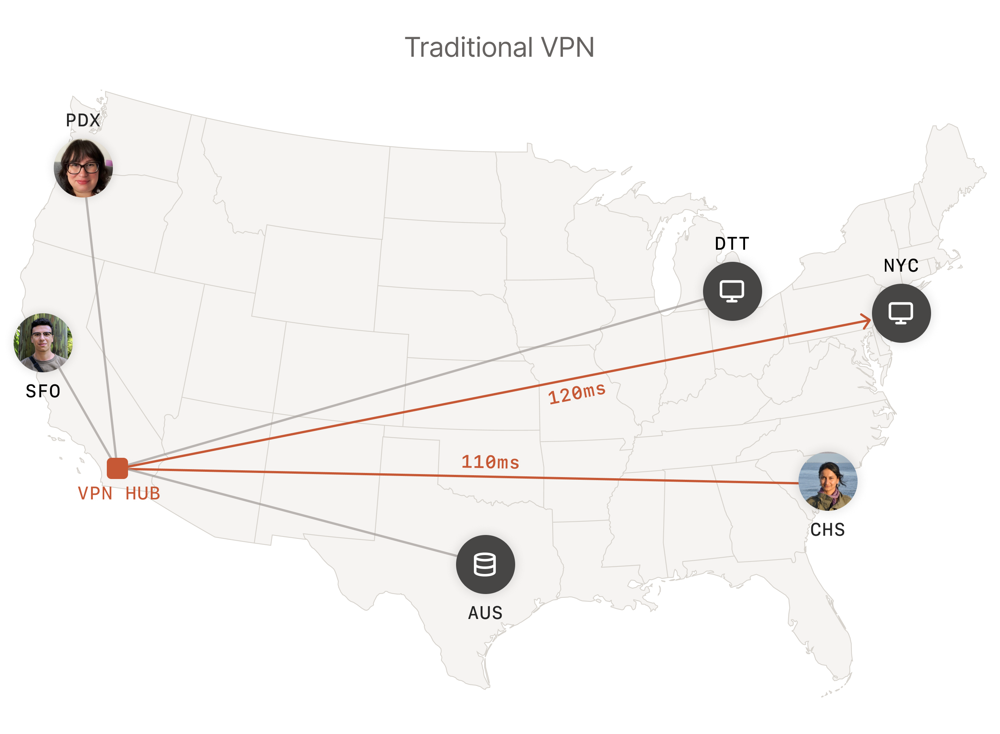
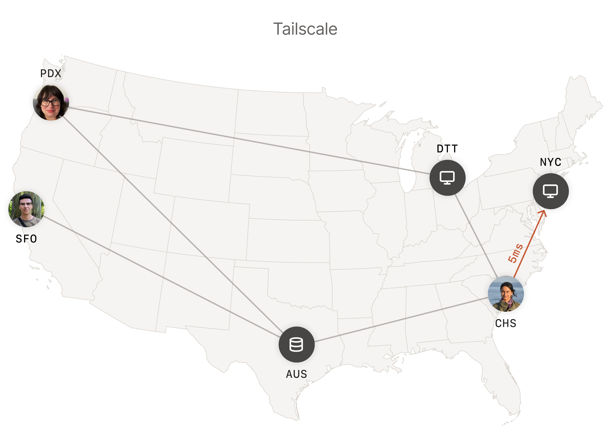
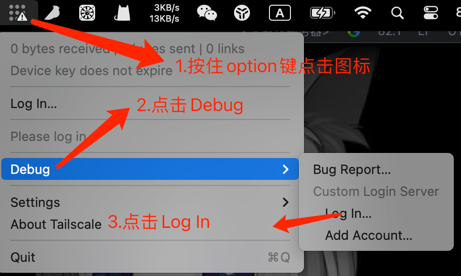
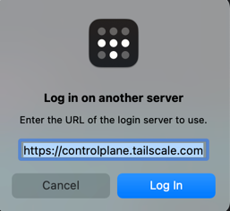
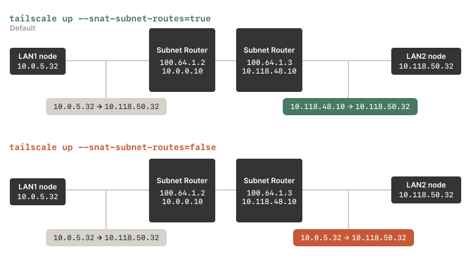

### 简介
#### 什么是Tailscale
> Tailscale 是一项 VPN 服务，可让您在世界任何地方安全、轻松地访问您拥有的设备和应用程序。
> 它使用开源WireGuard协议实现加密的点对点连接，这意味着只有专用网络上的设备才能相互通信。
#### 好处
> Tailscale 建立在安全网络结构之上，与传统 VPN 相比，提供速度、稳定性和简单性。
> Tailscale 快速且可靠。与通过中央网关服务器传输所有网络流量的传统 VPN 不同，Tailscale 创建了一个点对点网状网络（称为 tailnet:




### 安装
#### Ubuntu 22.04
**自动安装**
> curl -fsSL https://tailscale.com/install.sh | sh
> 
**手动安装**
1. 添加 Tailscale 的包签名密钥和存储库:
> curl -fsSL https://pkgs.tailscale.com/stable/ubuntu/focal.noarmor.gpg | sudo tee /usr/share/keyrings/tailscale-archive-keyring.gpg >/dev/null
> curl -fsSL https://pkgs.tailscale.com/stable/ubuntu/focal.tailscale-keyring.list | sudo tee /etc/apt/sources.list.d/tailscale.list
2. 安装Tailscale:
> sudo apt-get update
> sudo apt-get install tailscale

#### MacOS
**[下载](https://pkgs.tailscale.com/stable/Tailscale-1.46.1-macos.zip)**
解压下载好的压缩包，然后安装

#### Docker
docker-compose.yml
```yaml
version: '3.8'
services:
  tailscale:
    image: tailscale/tailscale
    container_name: tailscale
    privileged: true
    # 如果headscale是自签名证书需要添加这行
    command:
      - "update-ca-certificates"
    volumes:
      - ./tailscale:/var/lib/tailscale
      - /dev/net/tun:/dev/net/tun
      # 如果headscale是自签名证书需要添加这两行
      - ./tls/**.crt:/etc/ssl/certs/**.crt
      - ./tls/**.crt:/usr/local/share/ca-certificates/**.crt
    cap_add:
      - NET_ADMIN
      - NET_RAW
```

### 连接Headscale
#### 两种方式
1. 通过服务端确认
2. 服务端生成授权Key
本教程使用**服务端生成授权Key的方式**
#### 服务端创建用户和生成授权Key
```shell
# 创建用户,headscale默认没有用户，必须手动创建一个
sudo headscale users new vpn
# -e 代表授权Key过期时间
sudo headscale preauthkeys create -e 9999d
```
#### Ubuntu
```shell
# tailscale登陆headscale
sudo tailscale --login-server=https://xx.xx.xx --auth-key=xxxxxx --accept-dns=false --accept-routes --reset
```
#### MacOS



> 复制最后一行代码，在headscale所在机器执行这段命令
> 将USERNAME改成自己创建的用户
> Ubuntu需要加上sudo

### 总结
1. 到此Tailscale+Headscale搭建内网穿透就成功了，可以多台机器上安装Tailscale并注册到Headscale服务，使用VPN内网IP就可以互相访问了。
2. Tailscale还有一个功能就是子网路由
   
通俗点讲就是在家里面的路由器上和手机上安装Tailscale客户端，路由器充当网管，无论你走到哪儿，都可以访问家里面的任意一台设备，比如说NAS，具体配置查看[官网教程](https://tailscale.com/kb/1019/subnets/)
3. 如果觉得子网路由功能无法满足，Tailscale还有一个功能是点到点网络
   
按照我的理解就是，在公司的某一台机器上安装Tailscale，在家里的路由也安装Tailscale，同时打开公司和路由器上打开IP转发功能，然后在公司就可以通过NAS的局域网IP进行访问，同时也可以在家里面通过公司局域网IP访问数据库等相关资源，具体配置查看[官网教程](https://tailscale.com/kb/1214/site-to-site/)
4. Tailscale的其他功能远不止这些，更加好玩儿的功能，还得研究官方文档
5. 关于如何搭建Headscale自托管服务，请参考我的另外一篇文章：[内网穿透解决方案-Headscale](https://boothua.cn/posts/87cda224.html)
